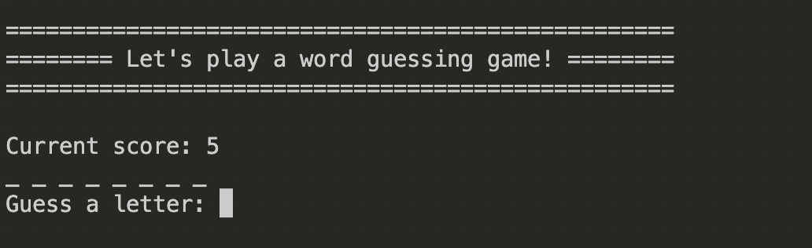
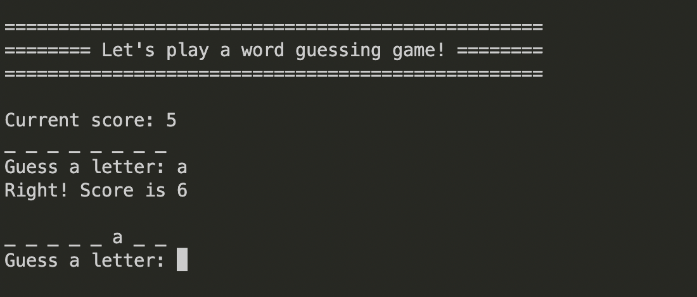
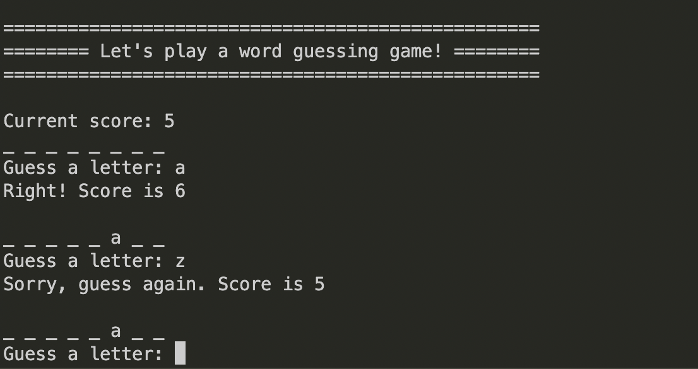
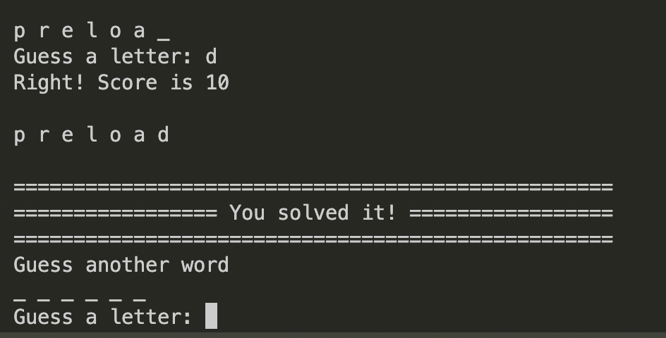
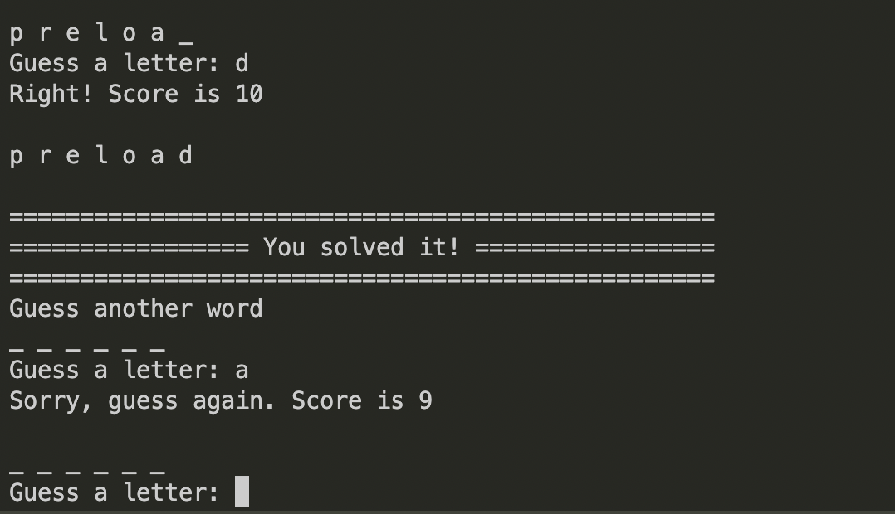
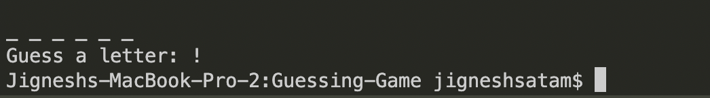

# Guessing Game

## Topics Covered
1. Removing non-alpha tokens
2. Removing stopwords
3. Lemmatizing tokens
4. POS tagging

## Table of Contents
- [Running Guessing Game](#Running-Guessing-Game)
  - [Input parameters](#Input-parameters)
  - [Starting guessig game](#Starting-guessig-game)
  - [Summary](#Summary)
  - [No parameter error](#No-parameter-error)
  - [Beginning](#Beginning)
  - [Correct Guess](#Correct-Guess)
  - [Incorrect](#Inorrect-Guess)
  - [Win](#Win)
  - [Loose](#Loose)
  - [Stop](#Stop)

## Running Guessing Game

### Input parameters
The program requires a `input file` to read and extract words for the guessing game
The input file can be provided using `-i` or `--input` flags

### Starting guessig game
```
pipenv run python3 main.py -i anat19.txt
```

### Summary
On reading the input file the program will provide the summary of the file


### No parameter error
If no `input file` is provided the program will show following error


### Beginning
The game begins with the player having 5 points



### Correct Guess
If the player guess a correct letter the 1 point will be added to the score



### Incorrect Guess
If the player guess a incorrect letter the 1 point will be deducted from the score



### Win
If the player guesses the word correctly next





### Loose
If the score becomes 0 the player looses and the game stops


### Stop
To stop the game the player can use `!`


