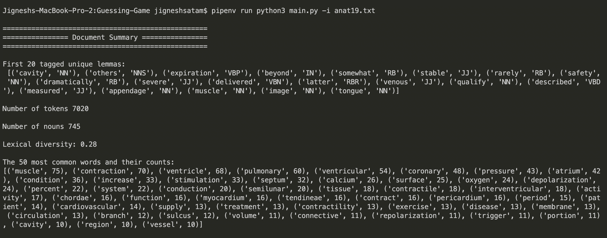
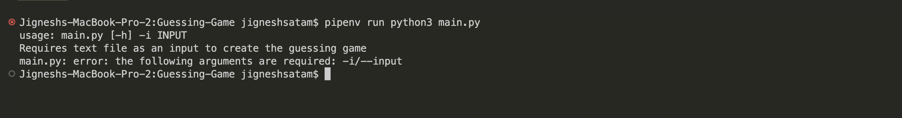

# Guessing Game

## Topics Covered
1. Removing non-alpha tokens
2. Removing stopwords
3. Lemmatizing tokens
4. POS tagging

## Table of Contents
- [Running Guessing Game](#Running-Guessing-Game)
  - [Input parameters](#Input-parameters)
  - [Starting guessig game](#Starting-guessig-game)
  - [Summary](#Summary)
  - [No parameter error](#No-parameter-error)

## Running Guessing Game

### Input parameters
The program requires a `input file` to read and extract words for the guessing game
The input file can be provided using `-i` or `--input` flags

### Starting guessig game
```
pipenv run python3 main.py -i anat19.txt
```

### Summary
On reading the input file the program will provide the summary of the file



### No parameter error
If no `input file` is provided the program will show following error


